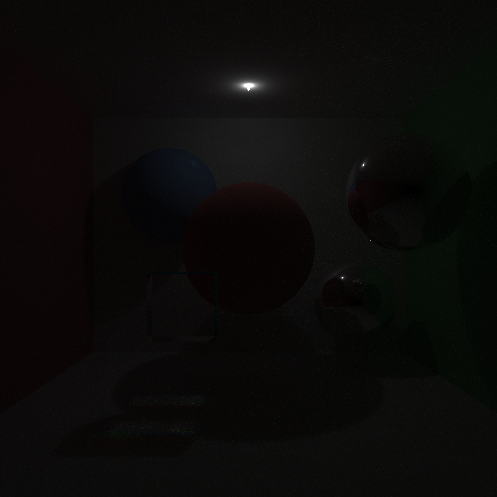
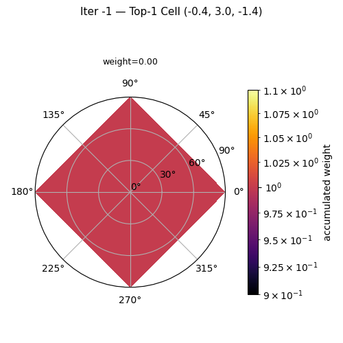
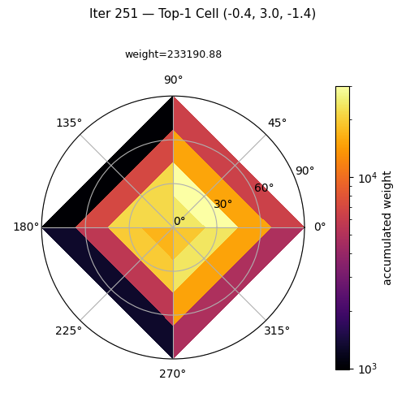
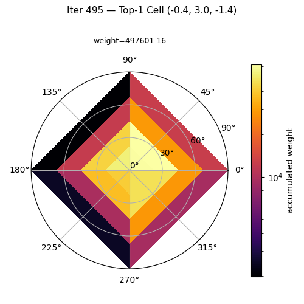
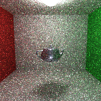
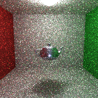
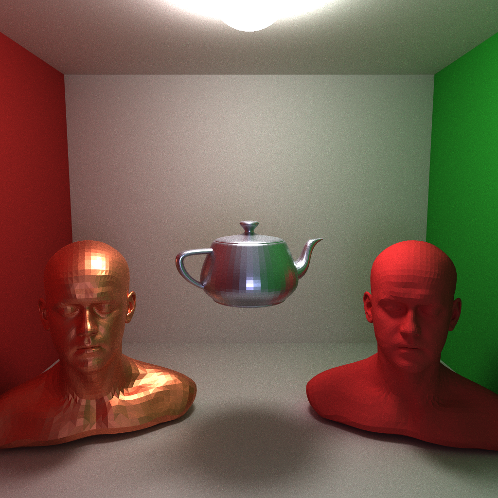
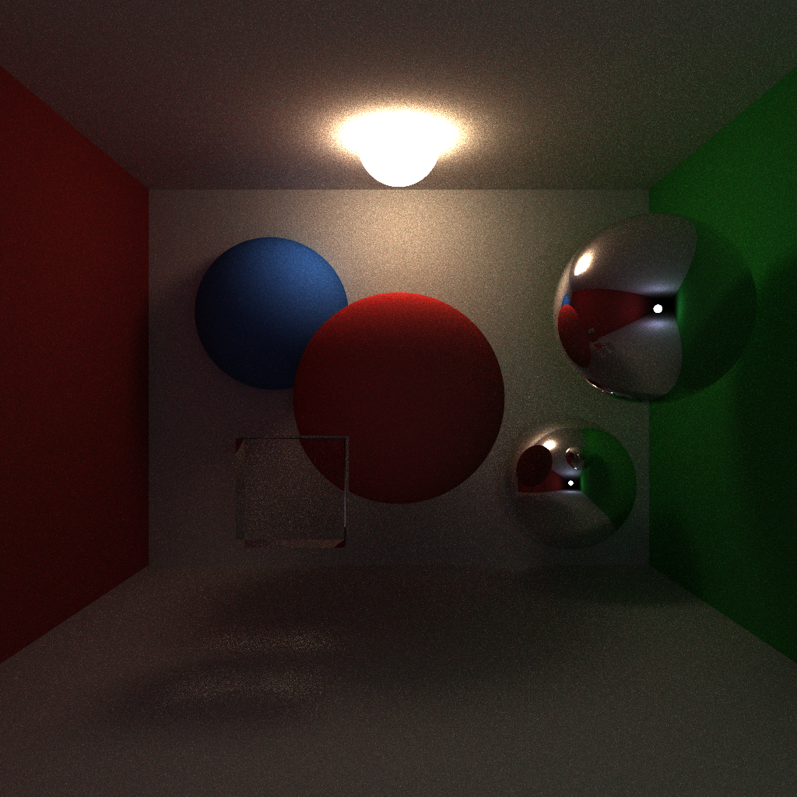

# 真实感渲染大作业报告

姓名：孙晨翔
班级：计41
学号：2024010679
**PS：大作业文档基础功能要求的两处对比分析放在第五部分了**
___

## 一、功能列表
- Path Guiding
- 复杂网格模型及其求交加速（包围盒和层次结构）
- 色散
- 基于 CUDA 的 GPU 并行加速
- MIS
- 法向插值
- 伽马校正
- 基于 OpenMP 的 CPU 并行加速

## 二、未验收功能
### 1、Path Guiding

正常的路径追踪，从镜头发出的寻找光源的线路在表面上都是随机取向的，如果通往光源的路径很少或者藏在角落里，大部分方向都——碰不到光源、贡献为零。Path Guiding 让渲染器在渲染过程中自己学会"往哪走容易找到光"，学习出一个空间中光源的大致分布。然后在后续采样时，通过一个线性提升的比例来控制以逐渐升高的概率向光源潜在区域探索。

具体而言，对于场景中每个位置，维护一个方向分布，记录"从历史上看，往这个方向弹射带来了多少 radiance"。

分布用一个空间-方向直方图来表示：把场景划分为均匀的 3D 空间网格，每个格子里存一个半球方向直方图（θ, φ 分 bin）。每轮迭代渲染时，路径追踪的结果被记录到这些直方图里。

#### 代码实现

**数据结构**。`DirectionalHistogram` 管理单个空间格子的方向分布：`_sum[θ][φ]` 累积入射 radiance 的亮度权重，`normalize()` 后构建边缘 CDF（θ）和条件 CDF（φ），`sample()` 用二分查找按概率采样方向，`pdf()` 返回给定方向的概率密度不必多说。

`GuidingDistribution` 管理整个场景的空间-方向分布。构造时根据场景包围盒划出均匀空间网格，每个格子里放一个 `DirectionalHistogram`。核心方法就三个：`record(pos, N, wi, weight)` 记录一条光线样本，`sample(pos, N, r1, r2, wi, pdf)` 按已学习的分布采样方向，`finishIteration()` 把一轮所有线程攒下来的数据归一化。

**渲染流程**。开启 path guiding 后，整个渲染从之前一遍跑完变成了多轮迭代。主循环如下：

1. **初始化**：算场景包围盒，建空间网格（6³=216 格，这个设置为参数可以在config中调节），每个格子 4×4=16 个方向 bin（同样可调节）。
2. **每轮迭代**：由于学习到的分布的可信度是逐渐提高的，一个naive的想法是维护一个`guideProb`——前 20% 轮纯粹学习（guideProb=0），20%~60% 从 0 线性爬升到 0.9，后 40% 保持 0.9。然后渲染所有像素。（论文中的实现是从0爬升到0.5，但是由于难于构造到非常合适的测例，为了展现算法的有效性，我极大的提高了这个爬升的速度，并且构造了专门的测例以突出效果，见后面的效果展示环节）
3. **路径追踪**（`tracePath`）：delta 材质方向确定，不参与 guide。对于非 delta：

   - 先做 NEE 直接光照采样，算完这部分 radiance 后记录下当前累计值 `radianceAfterNEE`；
   - 然后采样 continuation 方向：如果 guide 已训练且 `guideProb > 0`，用 MIS 融合 BRDF 采样和 guide 采样；否则纯 BRDF 采样；
   - **延迟记录**：把 `(位置, 法向, 采样的 wi)` 和 `radianceAfterNEE` 暂存到数组里；
   - 路径结束后回填, 对每个暂存的顶点，计算 `weight = max(总radiance) - max(该顶点NEE后radiance)`，这个差值恰好等于**该顶点通过方向 wi 对图像的真正贡献**,包含了 BSDF × 后续入射 radiance ÷ MIS pdf，正是 guide 应该学习的量。


4. **`finishIteration()`**：这轮的路径全部跑完后，把所有直方图归一化。下一轮开始，guide 就可以用来采样了。

#### 测试效果
<div style="display: grid; grid-template-columns: 1fr 1fr; gap: 16px; width: 100%;">
  <div style="aspect-ratio: 1 / 1; overflow: hidden;">
    
  </div>
  <div style="aspect-ratio: 1 / 1; overflow: hidden;">
    
  </div>
</div>
唯一的光照从一条缝隙中传来，在同样的迭代轮数下（200SPP），未开启 PG (左图) 的结果明显比开启了PG的结果多出非常多的黑色噪点

另外，为了debug，还写了某一点学到的光照空间分布的可视化图，正好可以用来验证学习的有效性，测例如下：

环境非常黑，只有一个极小的发光球体作为光源，从发光球体出发，向镜头走0.04，向左走0.04，向下走0.05，来到可视化数据的采样点，此时，光源在采样点的“右 前 上”方
<div style="display: grid; grid-template-columns: 1fr 1fr 1fr; gap: 16px; width: 100%;">
  <div style="aspect-ratio: 1 / 1; overflow: hidden;">
    
  </div>
  <div style="aspect-ratio: 1 / 1; overflow: hidden;">
    
  </div>
  <div style="aspect-ratio: 1 / 1; overflow: hidden;">
    
  </div>
</div>
从左到右分别是初始化均匀分布，第251次迭代、第495次迭代后（共500次迭代，每迭代20spp）的采样点的光源空间分布图，圆上的不同角度即为相对于采样点的极坐标角度，圆心为采样点，越远离圆心的地方，也代表实际空间中远离采样点的地方。光源越有可能分布的地方，颜色越偏亮黄色。图像上方的weight代表这一点累计收到的贡献总数，越高说明采到了光源的样本越多，越可信。

可以清晰看出，光照分布有着显著的变化，并且正确的学习到了位于“右前上方”的光源，而左测几乎完全没有光照。

### 2、包围盒和层次结构

#### 算法思想

大作业文档中提供的网址中，模型动辄上万三角面，每根光线暴力遍历全部三角面的 O(N) 复杂度完全不可接受。BVH是最经典的加速方案：把场景中的几何体用轴对齐包围盒（AABB）一层层包起来，形成一棵二叉树层次。光线求交时先测包围盒——没命中就直接跳过整棵子树，命中了才递归进行具体的求交。显然，对于 N 个三角面，遍历代价从 O(N) 降到约 O(log N)。

#### 代码实现

这个功能是最后实现的，为了避免写崩整个项目，整个 BVH 实现在一个独立的模块中（好在这是可能的），夹在解析scene文件之后，开始路径追踪之前。

核心维护一个 S 形数组存储的二叉树：每个节点存包围盒的最小/最大顶点，以及两个整数区分内部节点（存左右子节点索引）和叶节点（存首个 primitive 的起始位置和数量）。

构建用 Surface Area Heuristic 策略：递归地把 primitive 按最长轴排序，在所有可能的分割点中选使 SAH 代价函数最小的那个。代价函数即 = 遍历开销 + 左右包围盒表面积加权 × 各自的 primitive 数。当 primitive 数量 ≤ 4 或 SAH 认为不分割更优时停止递归。

为了防止递归爆炸，求交则用显式栈迭代遍历替代递归：

```
stack = [root]
while stack:
    node = stack.pop()
    if 光线与node的AABB不相交: continue
    if 叶节点:
        逐一求交该范围内的所有三角面
    else:
        stack.push(左子)  // 先推远的，后推近的
        stack.push(右子)
```

#### 测试效果
由于没有采用包围盒层次结构的算法对于复杂模型非常慢，用茶壶模型（15K面片），在200*200分辨率下跑10SPP的简短测试，得到的效果和加速比如下：
<div style="display: grid; grid-template-columns: 1fr 1fr; gap: 16px; width: 100%;">
  <div style="aspect-ratio: 1 / 1; overflow: hidden;">
    
  </div>
  <div style="aspect-ratio: 1 / 1; overflow: hidden;">
    
  </div>
</div>

- 加速前：213s
- 加速后：4s
- Speedup = 53 倍

相同配置，开启包围盒加速后，渲染速度快了53倍！

以上为速度测试，下图为更多复杂网格图形的效果展示：


### 3、基于CUDA的GPU加速

#### 哪些地方能加速，怎么加速

路径追踪的加速空间非常大，每个像素完全独立，像素 A 的着色与像素 B 没任何关系。这非常适合 GPU 计算，几千个核同时跑，一个线程算一个像素。

但 CPU 和 GPU 的内存是隔离的。要把场景搬进显存，必须先把面向对象的场景图（Group 套 Transform 套 Mesh 套一堆 Triangle）拍扁成无指针的平面数组，**这一步极其困难，稍有差错就会丢失数据，或者段错误。**

具体来说，CPU 端 C++ 的 `vector`、`map`、虚函数表、`Object3D*` 指针这些在 GPU 上全都不存在。必须把每个几何体的全部字段展开成一个纯结构体，用 `cudaMalloc` 在显存上分配，然后 `cudaMemcpy` 拷过去。下面展示了转换前后的数据形态：

```
CPU 端 (面向对象)                    GPU 端 (扁平数组)
Group                               GPUScene {
  ├─ Transform { matrix }              spheres[i] = {cx,cy,cz,r,mat_id}
  │   └─ Mesh {                        triangles[i] = {v0..v2, n0..n2, mat_id}
  │         v[]  ← 顶点                  materials[i] = {kd,F0,atten,ior,...}
  │         t[]  ← 三角索引              tri_bvh[]   = {bmin,bmax,left,right}
  │         n[]  ← 法向                  sphere_bvh[]
  │       }                           }
  ├─ Sphere { center, radius }
  └─ Plane { normal, d }
```

拍扁之后，所有三角面无非就是一个大数组，所有球体也是，所有材质也是，全部拷进 device memory，kernel 直接拿下标访问。BVH 同样扁平化上传，遍历靠 while 循环 + 线程本地小栈，不需要递归也不想用递归。

另一个关键点是随机数。GPU 上没法用 `std::mt19937`，每条光线上百次随机采样，每个线程自己维护一个独立的随机状态。这里用了 PCG 哈希，输入 thread 位置和采样序号，输出 [0,1) 均匀分布，周期足够长不会出现多线程撞种子的问题。

#### 代码实现

**展平**。`flattenScene` 函数遍历场景图。每遇到 Transform 就把它的逆矩阵累积进来，遇到几何体就用累积矩阵把顶点变换到世界空间，填进对应的扁平数组。以球体为例：

```cpp
// Transform: multiply into accInv
Matrix4f M = accInv.inverse();
Vector3f c = (M * Vector4f(s->getCenter(), 1)).xyz();
float sx = M.getCol(0).xyz().length();  // handle non-uniform scale
out.spheres.push_back({c.x(), c.y(), c.z(), s->getRadius() * sx, matId});
```

对 Mesh 则遍历所有三角面，顶点用 `accInv.inverse()` 变换，法向用 `accInv.transposed()` 变换（逆矩阵的转置保证法向正确）。材质统一编号，用一个 `map<Material*, int>` 记录 CPU 指针到 GPU 下标的映射，消除此后所有虚函数调用。展平结束后，为三角面和球体各自建一棵 CPU BVH，按 BVH 的 primitive 排列顺序重排对应的数组（保证同一叶节点内的 primitive 在内存中是连续的），然后序列化节点数组一并上传。

**kernel 调度**。每个 CUDA thread 算一个像素：

```cpp
dim3 block(16, 16);                        // 256 threads/block
dim3 grid((w + 15) / 16, (h + 15) / 16);  // 铺满全图
path_trace_kernel<<<grid, block>>>(d_spheres, nSpheres, d_tris, nTris,
    d_sphereBVH, d_triBVH, d_mats, nEm, d_emIdx,
    scene.cam, bg_r, bg_g, bg_b, d_output, samples, mode, useSmooth, useFresnel);
```

kernel 内通过 `blockIdx × 16 + threadIdx` 得到像素坐标 `(px, py)`。每个像素跑指定 spp，每个采样用 PCG 哈希生成两个 jitter 值偏移子像素位置，然后从相机参数生成世界空间光线。

**路径追踪循环**。跟 CPU 版本的渲染逻辑完全一致，只不过把串行的"for 每个像素、for 每个采样"变成了 GPU 的几千个线程各算各的并行计算，从而获得了数十倍的加速。核心循环伪代码：

```
radiance = 0; throughput = (1,1,1)
for depth = 0..9:
    if depth > 3: RussianRoulette()
    hit = BVH_intersect(ray)
    if 未命中: radiance += throughput × bg; break
    if 命中发光体:
        if depth==0 或 上一跳是delta: radiance += throughput × emission
        else: radiance += MIS_BRDF(上一跳信息) // BRDF侧MIS
        break
    if 非delta:
        for each emissiveSphere:  // NEE
            lwi = normalize(lp - hitPoint)
            if shadowRay未遮挡:
                pdf_light = pdf_area × dist² / cosLight
                pdf_brdf = BRDF_pdf(wo, lwi)
                mis_w = pdf_light² / (pdf_light² + pdf_brdf²)
                radiance += throughput × emission × BRDF × mis_w / pdf_light
        保存当前顶点信息给下一跳MIS用
    采样下一方向 wi:
        漫反射: cosine_weighted_hemisphere
        镜面: reflectDirection
        折射: refractDirection 
        glossy: 按亮度比选漫反射/GGX lobe
    throughput *= BRDF(wo,wi) / pdf
    ray = {hitPoint, wi}
output[py][px] = radiance / samples
```

所有采样跑完后除以 spp 得到最终颜色。kernel 全结束后 `cudaDeviceSynchronize()` 等所有线程跑完，`cudaMemcpy` 拷回主机内存保存为图片即可。

**加速效果**
**1024*1024分辨率，100SPP，左图只开OpenMP加速，右图开CUDA加速**
<div style="display: grid; grid-template-columns: 1fr 1fr; gap: 16px; width: 100%;">
  <div style="aspect-ratio: 1 / 1; overflow: hidden;">
    
  </div>
  <div style="aspect-ratio: 1 / 1; overflow: hidden;">
    
  </div>
</div>

- CPU: 67s
- GPU: 2s
- Speedup = 33.5 倍

## 三、最终渲染图


## 四、已验收功能

### 1、色散

白光穿过棱镜会散成彩虹，这是因为不同的折射率对不同的波长光不同。在路径追踪里模拟色散也不困难：当光线射入一个有色散属性的折射材质时，不是老老实实折射一根光线，而是随机给这条光线"染色"——按 1/3 概率选 R、G、B 中的某一个通道，用这个通道对应的折射率（基础折射率 + 该通道的偏移量-可调整的参数）来算折射方向。选完之后，其他两个通道的 throughput 直接清零，乘 3 来保证能量守恒。当然，代价就是每个通道只能得到1/3的样本，更难收敛，容易出现彩色噪点。

代码上很简单：在 `tracePath` 的折射分支里，如果材质开了色散且光线正在进入介质，摇一个随机数决定通道，用偏移后的折射率算 `eta`，然后清零另两个通道：

```cpp
float r = randf(); int ch;
if      (r < 1.0/3.0) { ch=0; ior = baseIOR - disp*0.5; }
else if (r < 2.0/3.0) { ch=1; ior = baseIOR; }
else                   { ch=2; ior = baseIOR + disp*0.5; }
throughput *= Vector3f(ch==0?atten.x:0, ch==1?atten.y:0, ch==2?atten.z:0) * 3.0;
```

**效果对比（左图未开启色散，右图开启色散）**
<div style="display: grid; grid-template-columns: 1fr 1fr; gap: 16px; width: 100%;">
  <div style="aspect-ratio: 1 / 1; overflow: hidden;">
    
  </div>
  <div style="aspect-ratio: 1 / 1; overflow: hidden;">
    
  </div>
</div>

### 2、MIS（多重重要性采样）

路径追踪里有两套互补的采样策略：NEE 直接从光源表面采样、BRDF 从材质的高概率方向采样。当光源小而远时，NEE 很准但 BRDF 很难恰好弹到；当光源大而近时，BRDF 随手一弹就能命中。MIS 把两路的估计量加权混合：权值用幂启发式，各取 PDF 的平方除以 PDF 平方和。这样哪路更有效，它的权就自动更大，最终结果不会比单走任何一路差。

实现中，非 delta 表面每次弹射都做两件事：NEE 阶段采发光体表面，出来一个 radiance 估计量，乘以 `pdf_light² / (pdf_light² + pdf_brdf²)`；BRDF 弹射如果下一跳命中发光体，同样用上一跳保存的 BRDF 信息反算一个估计量，乘以 `pdf_brdf² / (pdf_light² + pdf_brdf²)`。两路完全对称，分母相同，保证无偏。
**效果对比（左、中、右分别为 仅BRDF，仅NEE，MIS）**
<div style="display: grid; grid-template-columns: 1fr 1fr 1fr; gap: 16px; width: 100%;">
  <div style="aspect-ratio: 1 / 1; overflow: hidden;">
    
  </div>
  <div style="aspect-ratio: 1 / 1; overflow: hidden;">
    
  </div>
  <div style="aspect-ratio: 1 / 1; overflow: hidden;">
    
  </div>
</div>

### 3、法向插值

低面数三角网格模型面与面之间会有明显的棱。法向插值不做任何几何修改，只在着色阶段对法向量做文章：三角内部任意点的着色法向 = 三个顶点法向按重心坐标混合。顶点法向由周围各面的面法向取平均得到。这样 低面数的模型也能看起来圆润。

实现分两步。OBJ 加载后在 CPU 端算顶点法向：遍历所有面，面法向取叉积，累加到三个顶点的法向累加器上，最后归一化。渲染时，光线命中三角后，用已有的重心坐标做线性插值：

```
N_shading = normalize((1-β-γ) * N₀ + β * N₁ + γ * N₂)
```
**效果对比（左图未开启，右图开启）**
<div style="display: grid; grid-template-columns: 1fr 1fr; gap: 16px; width: 100%;">
  <div style="aspect-ratio: 1 / 1; overflow: hidden;">
    
  </div>
  <div style="aspect-ratio: 1 / 1; overflow: hidden;">
    
  </div>
</div>


### 4、伽马校正

显示器不是线性的，路径追踪算出的是线性辐射度值，直接写进图片会被显示器压暗。伽马校正就是写文件前做一次逆运算 `pow(x, 1/gamma)`，显示器的 `pow(x, gamma)` 再压一次，两者抵消，人眼看到正确亮度。

实现是纯后处理，一行代码的事：

```cpp
powf(c.x(), 1.0f/gamma)  // 逐通道
```
**效果对比（左、中、右分别为 gamma = 1.0 1.5 2.2）**
<div style="display: grid; grid-template-columns: 1fr 1fr 1fr; gap: 16px; width: 100%;">
  <div style="aspect-ratio: 1 / 1; overflow: hidden;">
    
  </div>
  <div style="aspect-ratio: 1 / 1; overflow: hidden;">
    
  </div>
  <div style="aspect-ratio: 1 / 1; overflow: hidden;">
    
  </div>
</div>


### 5、基于 OpenMP 的 CPU 并行加速

像素之间完全独立，外层 y 循环天然可以并行。OpenMP的 `#pragma omp parallel for schedule(dynamic)` 一行指令让编译器自动把循环切成多段，分给多个 CPU 核。`schedule(dynamic)` 表示动态调度——谁先算完谁领下一段，避免因路径深度不均导致部分核空转。

唯一的坑是随机数生成器。原来的 `randf()` 用全局 `mt19937`，多线程同时读写就是数据竞争。改成 `thread_local` 惰性初始化：每个线程首次调用时用一个原子计数器分配独立种子，创建自己的 `mt19937` 实例，之后各线程完全隔离。开关通过 `use_omp` 控制，关闭时 pragma 被静默忽略，回退单线程。

对同样的cornell测例渲染，1024*1024分辨率，100spp，渲染速度对比如下：
- 加速前：519s
- 加速后：64s
- SpeedUp：8.1 倍


## 五、基础功能对比要求

### 1、光线追踪 vs 路径追踪

<div style="display: grid; grid-template-columns: 1fr 1fr; gap: 16px; width: 100%;">
  <div style="aspect-ratio: 1 / 1; overflow: hidden;">
    
  </div>
  <div style="aspect-ratio: 1 / 1; overflow: hidden;">
    
  </div>
</div>

肉眼可见的差别有三处：

**噪点**。路径追踪用随机采样估计每个像素的颜色，有限采样数下必然有噪点。Whitted 每一步都是确定性计算——漫反射直接累加所有光源、镜面/折射走解析方向——画面完全干净，这是两者最本质的差异。

**间接光照（color bleeding）**。Cornell 盒的左右墙壁分别是红色和绿色。路径追踪图中，地板上靠近红墙的地方泛着暖红色，靠近绿墙的地方泛着淡绿色，这是漫反射表面之间互相照亮的结果。Whitted 完全没有这个效果，因为在 Whitted 的模型里，光线打到漫反射表面就直接停下来了，只算一次直接光照，不会有后续弹射。红墙的光不可能先弹到地板再弹到人眼里。

**软阴影与面光源表现**。场景中天花板有一个发光球体。路径追踪的 MIS 模式能正确采样面光源上的不同位置，产生自然的软阴影和柔和照明过渡。Whitted 使用点光源模型，明暗边界锐利，缺乏真实感。

根本原因是两种算法的光照模型完全不同。Whitted 把光照简化成"直接光 + 镜面反射 + 折射"三个独立通道，光源只能是若干抽象点。路径追踪则忠实模拟了物理方程：每个表面都是潜在的二次光源，光线的每一次弹射都在积分半球上的入射 radiance，最终收敛到全局光照的真实解。

### 2、NEE

<div style="display: grid; grid-template-columns: 1fr 1fr; gap: 16px; width: 100%;">
  <div style="aspect-ratio: 1 / 1; overflow: hidden;">
    
  </div>
  <div style="aspect-ratio: 1 / 1; overflow: hidden;">
    
  </div>
</div>

**左：纯 BRDF 采样；右：纯 NEE 采样**

相同 spp ，左图噪点明显非常多。

没有 NEE 的时候，路径追踪获取直接光照只靠 BRDF 按余弦分布随机弹射，恰好砸到发光体上。发光体越小，砸中的概率越低。Cornell 盒的天花板光源只有巴掌大一个球，从地板上看过去张角极小——绝大部分 BRDF 采样方向都弹向了黑暗的墙壁，路径白白浪费，贡献为零。反映到图上就是大片噪点，因为相邻像素"运气"差异巨大。

开了 NEE 之后，每条光线每次弹到非 delta 表面时，都主动去对所有发光体表面采一个点，连一条 shadow ray 过去。只要中间没挡、cos 项为正，这笔直接光照就一定有贡献。从图中可以看出，右侧画面的天花板附近、地板、墙壁的亮度分布更均匀、噪点大幅减少，收敛更快

### 3、glossy 材质
基础要求，但是好像没有单独展示过，这里直接展示材质效果，左图roughness = 0.15，右图roughness = 0.3
<div style="display: grid; grid-template-columns: 1fr 1fr; gap: 16px; width: 100%;">
  <div style="aspect-ratio: 1 / 1; overflow: hidden;">
    
  </div>
  <div style="aspect-ratio: 1 / 1; overflow: hidden;">
    
  </div>
</div>
