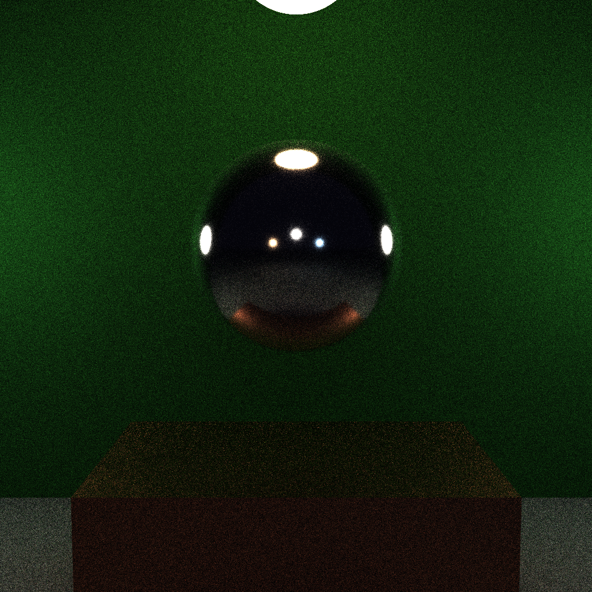

# 光线追踪 路径追踪

  

    
  

  

    
  

# NEE

  

    
  

  

    
  

# glossy

# MIS

  

    
  

  

    
  

  

    
  

# 法向插值

  

    
  

  

    
  

# 伽马校正

  

    
  

  

    
  

  

    
  

# 色散

  

    
  

  

    
  

